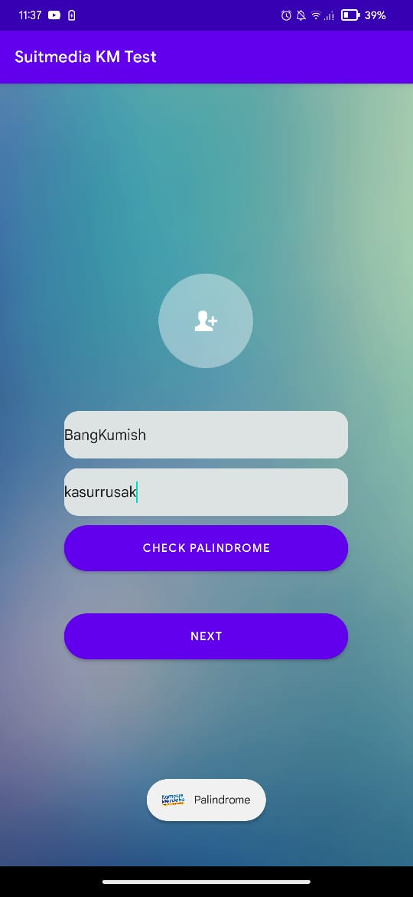
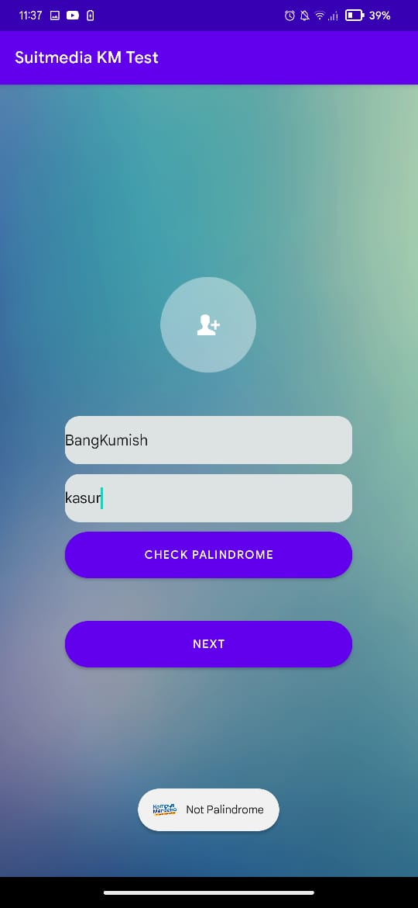
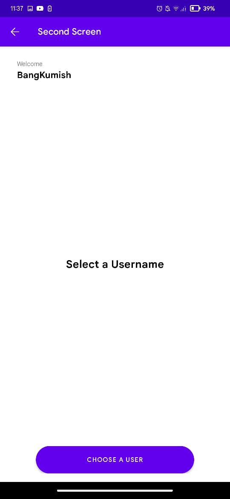
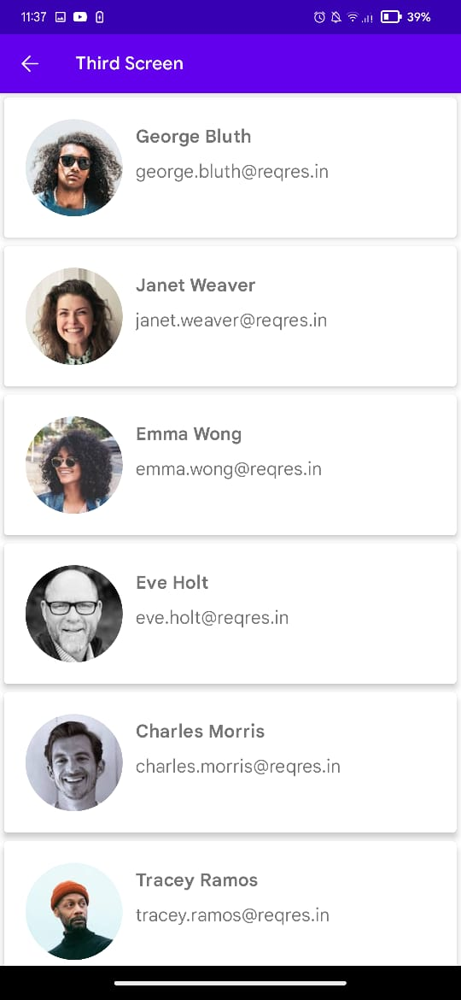
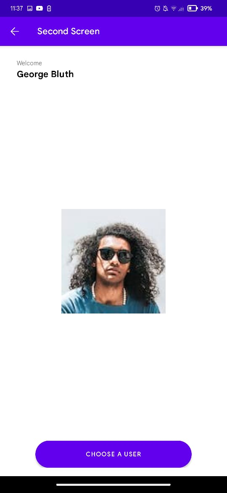

# Suitmedia's Kampus Merdeka Mobile Developer Intern Test

## This project was built to accomplish Suitmedia's Kampus Merdeka Mobile Developer Intern Test

## Tech Stack
- Retrofit
- Glide to Youuu
- I guess that's it

## What's this app do?
This app have 3 screen, 
- at First Screen there is a palindrome checker and a username editText give your best username, yeah? 
- at Second Screen, your username will displayed here and you can go to Third Schreen
- at Third Screen, parsing dummy api from reqres and list it with RecyclerView

## Snapshots
### FirstScreen Palindrome

### FirstScreen NotPalindrome

### SecondScreen after FirstSkreen

### ThirdSkreen

### SecendScreen after the Third One

## Adios
### Brought to you by Andreas Sihotang a.k.a. BangKumish
